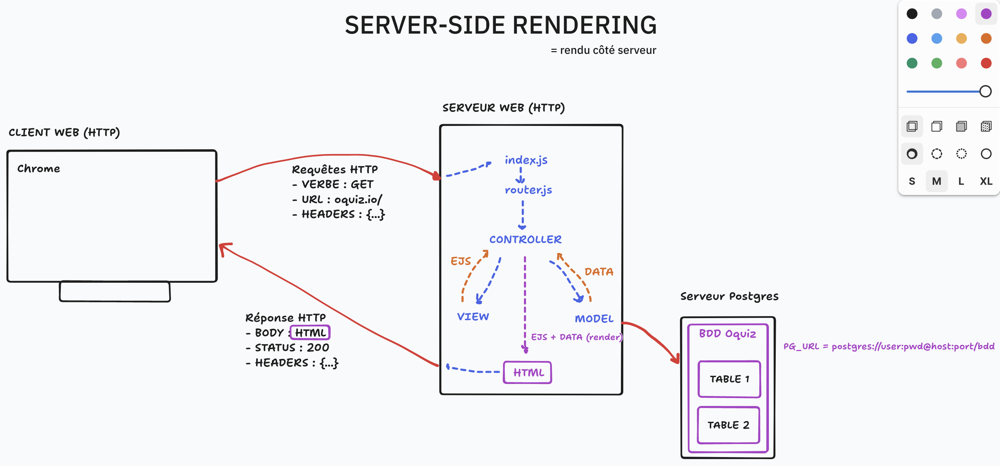

# API E01 - Architecture client-serveur & Modélisation

## Menu du jour 

```
=== Matin COURS ===

- Architecture client-serveur (API & SPA)
- Découverte des API & Client HTTP
- Découverte AJAX (fetch)

=== Aprem ATELIER ===

- Gestion de projet
  - User stories
  - Wireframes

- Modélisation
  - MCD : Modèle Conceptuel de Données (1-N)
  - MLD : Modèle Logique de DOnnées (id, foreignKey)
  - MPD (Bonus) : Script SQL de création de tables
```


## Notes

API REST = l'interface = renvoie de la donnée
- construire avec n'importe quelle techno : 
  - JS Express (S12)
  - Python Django
  - Java Springboot
  - Ruby RubyOnRails

Single Page Application SPA : Code qui requête l'API
- diverses techno possible : 
  - Vanilla JS (S13), manipulation DOM classique : document / querySelector / addEventListener
  - React (S15-16)
  - VueSJ / Svelte / Angular 


## API

**API** = **Application Programming Interface**
- une interface entre deux couches logicielles
- terme très générique qui désigne un bout de code qu'on peut appeler depuis un autre bout de code
- une API c'est une **liste de "fonctions"** (au sens large) à notre disposition

Exemple d'API (pas "Web" / pas "REST") : 
- **Model**
  - `.findAll()`
  - `.findByPk()`
- **document**
  - `.querySelector()`
  - `.addEventListener()`
- **Math** : 
  - `Math.random()`
  - `Math.floor()`

### API WEB (REST)

C'est une API qu'on contacte avec des requêtes HTTP.

Il existe de nombreuses API WEB :

- **Publiques**
  - avec authentification (avec clé d'accès)
  - sans authentification

- **Privée** 
  - interne à une entreprise
  - utilisé uniquement par un front spécifique (ex : github)

Dans l'idée, une **API Web est une interface vers une Base de Données** !

On peut **créer notre propre API** pour communiquer avec notre BDD, puis fournir notre API :
- à notre front
- et/ou au reste du monde


### Exemples d'API publiques

[Liste d'API publique](https://github.com/public-api-lists/public-api-lists)

- Pokémon
  - https://pokeapi.co/api/v2/pokemon/pikachu

- Star wars
  - https://swapi.dev/api/planets

- Spotify 
  - https://developer.spotify.com/documentation/web-api

- Dogs API
  - https://dog.ceo/dog-api/documentation/

- OMDB API 
  - https://www.omdbapi.com/

## Archicture

### Server-side rendering

**Idée** : le serveur régère la page HTML finale




### Architecture Client-Server

**Idée** : 
- le front et le back sont séparés
- l'API est une interface vers la BDD
- le code front gère son affichage dynamiquement, et requête l'API pour récupérer les données à afficher


