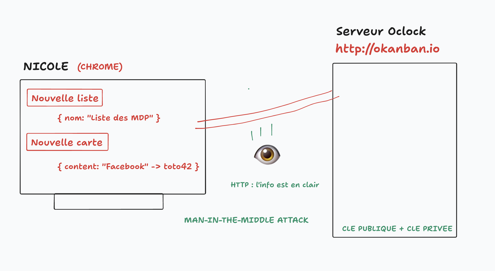

# S13E01 - Journée Sécurité

## Menu du jour

```
=== Matin (COURS) + Aprem (COURS) ===

- Pull Request
  - Relire la correction des routes /tags

- OWASP
  - Open Web Application Security Project
  - OWASP Top 10 (2021)

- Okanban 
  - [A03:2021-Injection]
    - Injections SQL & ORM (composants obsolètes et vulnérabilités)
    - Injections XSS & body sanitizer
  - [A04:2021-Insecure Design]
    - CORS (Cross-Origin Resource Sharing)
    - (bonus) DDOS & rate-limiting
    - (bonus) HTTP & HTTPS
  - [A05:2021-Security Misconfiguration]
    - Technical stack leaking
    - Database password policy

- Odomac
  - [A01:2021-Broken Access Control]
    - Broken ACL et middlewares
  - [A02:2021-Cryptographic Failures]
    - MD5 vs argon2id (ou scrypt, bcrypt)
  - [A07:2021-Identification and Authentication Failures]
    - Brute force attack
    - Password Policy
  - [A03:2021-Injection]
    - XSS, le retour
    - (bonus) CSRF attacks
```


## Sécurité

Notre API Okanban est-elle sécurisée : 
- si oui contre quoi ?
- si non contre quoi ?

De manière générale, quelles notions de sécurité vous connaissez ?


### Pas sécurisé

- **Pas d'authentification** et d'authorisation
  - Open Bar API
  - C'est dans les requirements
    - `A04:2021-Insecure Design`
  - ==> On pourrait écrire du code d'authentification
    - Laisser la possibilité à Nicole de se créer un compte
    - De se connecter : 
      - le backend génère un TOKEN D'ACCESS (ex: un jeton `JWT`) 
    - Pour les autres requêtes (POST,PATCH,DELETE), le front doit fournir le Token de Nicole pour l'authentifier
  - De toutes les façons, l'app de Nicole ne tournera que sur son local => c'est du hors ligne
  - Autre solution : mettre un MDP avant l'accès au kanban et une **clé d'API**

- **MDP BDD** : 
  - `.env` : le mdp de la BDD : `okanban`
  - les données de notre BDD de dev local
    - `npm run db:reset` => données d'échantillonnages, pas les vraies données de Nicole
  - lorsqu'on mettra en production, sur un vrai SERVEUR DE PRODUCTION, alors il faudra choisir un MDP suffisamment sécurisé pour notre BDD `okanban`. Sinon : `A05:2021-Security Misconfiguration`

- **Scripts NPM** : 
  - attention, notre script `npm run db:reset` est un bouton nucléaire, il ne doit pas être lancé en production
  - une posibilité c'est d'écrire un SCRIPT BASH à la place qui vise à VERIFIER l'environnement sur lequel le scirpt est lancé avant de lancer la commande

- **Protocole HTTPS** 
  - En local : HTTPS c'est surfait ! 
    - Fausses données
    - L'info transite entre ma RAM et ma RAM, donc difficile de chopper les données pour un attaquant
  - En production : **HTTPS** est necessaire
    - Creuser le foncitonnement de HTTPS : **https://howhttps.works/**




- **Limiter la tailles des body** : 
  - performance de notre app
  - `A05:2021-Security Misconfiguration`
  - ici, on a des risques d'attaque par **déni de service** en envoyant des body très "gros" à notre backend
    - ==> ici, on a rajouté une limite à la taille des body dans les requête `express.json({ limit: "10kb" })`
    - ==> **413: Payload too large**

- **Limiter le nombre de requêtes par unité de temps** 
  - notamment pour éviter les attaques **par déni de service**
  - utiliser un **rate-limiter**
  - ==> **429 : too many request**

- **Injection XSS**

### Sécurisé

- **Erreur 500 vagues** 
  - ==> `A05:2021-Security Misconfiguration`
  - de pas faire fuiter (leak) d'information sur la **stack technique** utiliser par nos API et nos serveurs.
  - ex : les erreurs 500 doivent rester vague et ne pas afficher la stack trace
  - ex : `app.disable('x-powered-by')`

- **Pas de endpoints cachés** / documentation

- **.env** : variables de config ne sont pas versionné
  - si leak des credentials de github (si qqun a accès à notre compte Github), il/elle ne trouvera pas le contenu du `.env` de production

- **Validation d'inputs** : Joi
  - **NEVER TRUST USER INPUT**
  - à partir de maintenant, sur tous vos controlleurs, quelque soit votre projet Express
    - que ça soit une API
    - que ça soit une app avec SSR (`res.render()`)
  - pensez à valider les entrées utilisateurs 
    - le serveur doit valider le type de données et autres critères selon le contexte

- **Injection SQL** :
  - demo injection
  - avec un ORM, **à condition qu'il soit à jour**, on est a priori protégé contre les injections SQL
    - vérifier que la lib est à jour et qu'il n'y a pas de vulnérabilité présente : `npm audit`
    - ou mieux : `npm i -g snyk` puis `snyk test` mais ça demande de créer un compte

- **CORS** : **Cross Origin Resource Sharing**
  - politique par défaut du navigateur


## Bonnes pratiques de sécurité Express

- Lecture recommandée : https://expressjs.com/en/advanced/best-practice-security.html
  - ex : utiliser `Helmet`


## CORS

- CORS = **Cross Origin Resource Sharing**

- **politique par défaut du navigateur** qui empêche un domaine A (ex: http://google.com) de faire des appels vers un domaine B (ex : oclock.io) sans autorisation du domaine B.

- Peut empecher qu'un site malveillant (domaine A) se fasse passer pour un site courant (domaine B) en appellant l'API du domaine B ou le site lui même. (site miroir)

- Erreur affichée par le navigateur : 
  - `Access to fetch at 'Domaine B' from origin 'Domaine A' has been blocked by CORS policy: No 'Access-Control-Allow-Origin' header is present on the requested resource.`

- Pour LEVER cette restriction sur les API qu'on souhaite rendre utilisable par d'autres domaines, ALORS on peut ajouter un header `Access-Control-Allow-Origin` : 
  - c'est le **SERVEUR (backend)** qui lève la restriction en autorisant une liste de domaines (ie, une liste de "fronts" autorisés à requêter l'API)

- Note : 
  - c'est une politique du navigateur
  - on peut toujours contacter l'API via Thunder Client / Insomnia et autres client HTTP.


- Bilan : 
  - si jamais vous avez un message d'erreur de type CORS,
    - soit vous appeler une API que vous n'avez pas le droit d'utiliser
    - soit vous apeler votre propre API, et dans ce cas il faut que vous ajoutiez le code **côté serveur** pour autoriser votre front !


## Faille XSS

- Un attaquant envoie dans un formulaire (ou une requête API) un script malveillant (généralement du JS).
- Lors que le script "revient" dans le navigateur d'un utilisateur final, il s'exécute.

Se prémunir d'une injection XSS : 
- **Côté serveur** : 
  - **never trust user input**
  - vérifier que les body ne contiennent pas de code JS malveillant 

- **Côté client** :
  - éviter que du code venant de la BDD puisse s'exécuter
  - par ex : éviter le `innerHTML`
  - en particulier, quand on consomme une API qui n'est pas la sienne, on fait particulièrement attention, car cette API pourrait être corrompu et envoyer des réponses contenant des injections XSS (qui par exemple, redirigeraient vos utilisateurs vers un site malveillant ressemblant au votre)


## Composants (`packages` / `node_modules`)

`package.json`

```json
"sequelize": "^6.14.1",

6: MAJEUR
14: MINEUR
1: PATCH

^ = indiquer à NPM que l'on souhaite une version COMPATIBLE avec la version demandée
```

En général : 
- `MAJEUR` 
  - grande différence d'implémentation et de fonctionnalités
  - breaking changes possibles 
- `MINEUR` : 
  - ajout de fonctionnalités à la marge
- `PATCH` : 
  - bug fix
  - performances
  - optimisation etc...


Lors du NPM installe, NPM va installer une version COMPATIBLE avec la `6.14.1`. 

Et il va déclarer dans le `package-lock.json` la version qu'il a réellement installée : pour figer la version EXACTE qui doit être installée en production avec `npm i --production` 

Note : 
- pour fixer les vulnérabilités : 
  - `npm audit` : lister les vulnés
  - `npm audit fix` : fixer les vulnés en modifiant le `package-lock.json` (et les `node_modules` installés)

- pour tenir à jour ces packages
  - `npm-check-updates`
    - `npm install -g npm-check-updates` (une seule fois suffit)
    - `ncu -u` : update le `package.json`
      - attention aux changements de versions MAJEURES des composants qui peuvent présenter des BREAKING CHANGES
    - supprimer le `package-lock.json` et les `node_modules` manuellement
    - réinstaller le tout avec `npm i`


## Attaque brute force

Le fait d'attaquer un formulaire avec une liste de credentials testés à la chaine et rapidement jusqu'à obtention d'une combinaison gagnante.

Pour s'en prémunir : 
- limite rate fort sur la route `/login`
- renforcer le choix d'un mot de passe FORT par l'utilisateur
- (pour aller plus loin) : logique de rejet au bout d'une certains nombre de tentative par compte

## Choix des technologique de chiffrement et de hachage

Choisir des méthodes de hachage pour stocker les mots de passe recommandés par OWASP : 
- `argon2id`
- `scrypt`
- `bcrypt` ==> demo dans `odomac`

Eviter :
- `md5`


