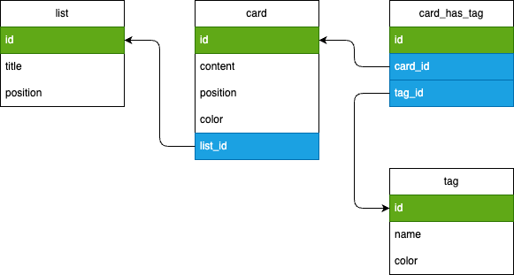

# MLD - Modèle Logique de Données

## Rappels : 

- Traduction du MCD en version technique
  - préparation à la mise en place en BDD
  - choix des noms des champs de la BDD
  - traduction des associaitons
  - traduction français => l'anglais

- Etapes :
  - 1. Traduire les entités en nom de tables
  - 2. Traduire les attributs en nom de champs
  - 3. Traduire les associations
    - 3.1. `One-to-One` : il suffit d'ajouter un champs (ex : notre cas pour `color`)
    - 3.2. `One-to-Many` : il suffit d'ajouter une clé étrangère (côté du 1) qui pointe vers la clé primaire de l'autre table
    - 3.3. `Many-to-Many` : il suffit d'ajouter une table de liaison avec deux clés étrangères qui pointent vers la clé primaire des deux tables liées
  - 4. (facultatif) : mettre les types en FRANCAIS pour éviter les jurys qui vous disent qu'on met pas de type sur un MCD
    - note : pourquoi ne pas mettre les types ? car à ce stade, on a pas encore choisi le SGBD qui nous va (type Postgres ≠ MariaDB ≠ MySQL ≠ Oracle)

## Version textuelle (recommandé comme brouillon et brainstorming)

```
list (
  id             -- Primary key
  title          -- Chaine de caractère (illimité)
  position       -- Entier
)

card (
  id             -- Primary key
  content        -- Chaine de caractère (illimité)
  position       -- Entier
  color          -- Chaine de caractère (code hexadecimal)
  list_id        -- Clé étrangère -> #list.id
)

label (
  id             -- Primary key
  name           -- Chaine de caractère (300max)
  color          -- Chaine de caractère (code hexadecimal)
)

card_has_label (
  id             -- Primary key
  card_id        -- Clé étrangère -> #card.id
  label_id       -- Clé étrangère -> #label.id
)
```

## Version schématique



