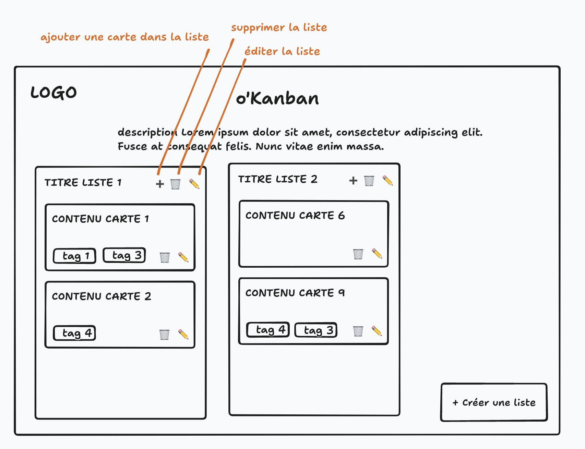

# Wireframes

Démarche : 
- **Zoning** > **Wireframe** > **Mockup**

Wireframe : 
- pas de couleurs (sauf pour la légende)
- légende est ok 
- icone ok si pas dans une optique de design
- objectif : 
  - clarifier les actions utilisateurs
  - CE N'EST PAS LE DESIGN de l'app

On peut très bien faire un wireframes :
- par fonctionnalité
- par bouton cliqué et modales affichées
- par état de l'utilisateurs (admin / membre / ...)
- device (mobile ou desktop)

Montrer 1 ou 2 wireframe au TP c'est très bien !

